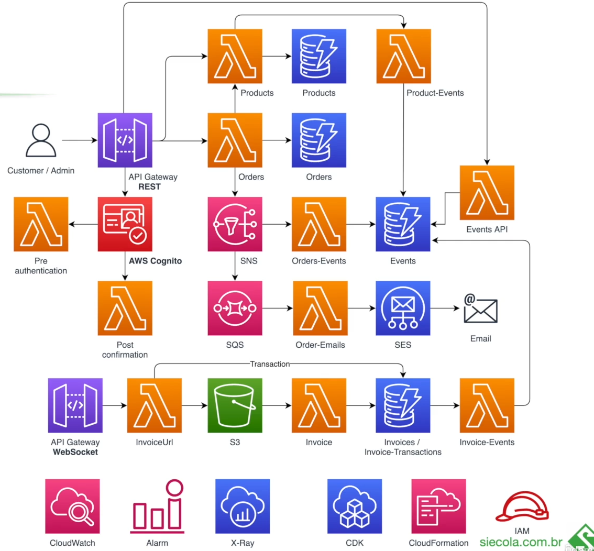

# Ecommerce project


## Stacks

- recursados que são corelacionados entre si
- Organização desses recursos depende de cada caso
  - colocar tudo em uma stack só
  - cada recurso tem sua propria stack
  - **O ideal  é encontra um meio de termo disso tudo**
- As Stacks podem ter dependencias entre si

### Exclusão de uma Stack

- **Os recursos tbm são apagados juntamente com a exclusão da stack**
- Obviamente isso deve ser configurado
  - uma tabelade de um database geralmente não é excluido

## CDK ****

### start a cdk project

```bash
cdk init --language typescript
```

### CDK WORKFLOW

- CODE IN CDK -> CLOUDFORMATION TEMPLATE  -> RESOURCES CREATION AND ETC.

## Arquitetura



