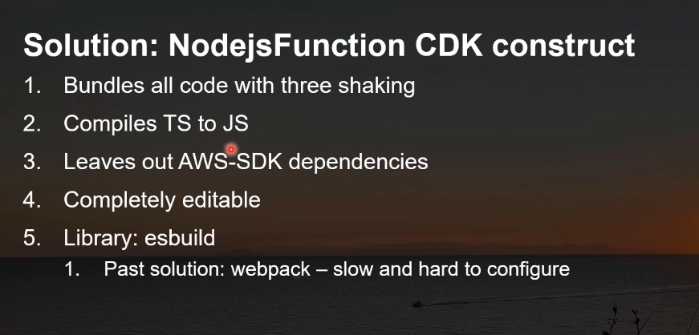
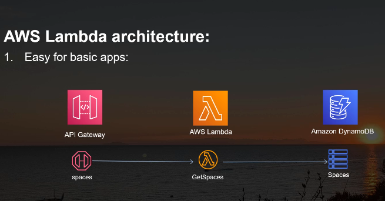
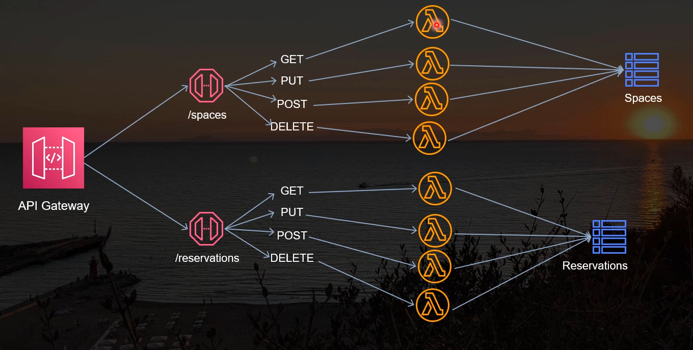
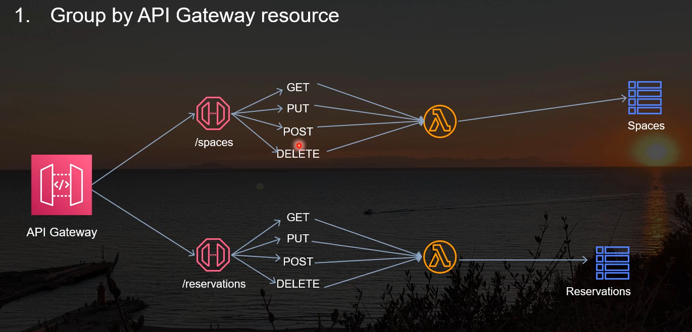

### AWS CDK 
- AWS CDK -> Cloud Development Kit
- We can write in programming language to write aws resources and cloudFormation templates so aws can run 

### AWS Serverless 
- Com Serverless, você só paga pelo tempo de execução do código e não se preocupa com infraestrutura.
- AWS will take care of scalability and other stuffs like that 

### AWS LAMBDA
- A basic piece of code wich can be run on demand(**AWS only will execute when its receive a request**)
- the heart of a serverless archicture

### AWS API Gateway 
- A Resource that let us do some requests( REST api or HTTP) over some resources that we have in our aws account.
- It will be the entry point for our application
- It will be the one that will receive the request and send to the lambda
- It will be the one that will receive the response and send to the client
- How it works:
  - We have a rest api, with some resources and methods
  - When we have a request, the api gateway will send to the lambda
  - The lambda will process the request and send the response back to the api gateway
  - The api gateway will send the response to the client
  

### DynamoDB 
- A Database Nosql from aws, great for: low latency, high performance and scabillity 

###  NodejsFunction CCDK construct 

### AWS Lambda Architecture 

From a basic point of view of a basic serverles application, we have: 

#### What if we extending a application 

- 1. Multiple lambdas:
  - 
  - deploy independently
  - **easier to log and monitor**

- 2. Group by Gateway Resource 
  - Which means that all the methods will be in one lambda for the things for a API Gateway 
  - 

- 3. Monolithic Lambda
  - All in a one single Lambda
  - Not the recommendation by AWS

- **Just a reminder: pay attention to Cold start for lambda!**

### DynamoDb 
- its a nosql database use for aws
- much easier than RDS to use with lambda and cdk 
  - i already use in my current job and we have some problems to use lambda with rds stuff
  -  Pay attention to the update in dynamoDB, it will be a pain in the ass if you don't do it right

### Marshalling and Unmarshalling
- Marshalling: Converting programming language types into DynamoDB format (ex: JS object -> DynamoDB item)
- Unmarshalling: Converting DynamoDB format back to programming language types (ex: DynamoDB item -> JS object)

